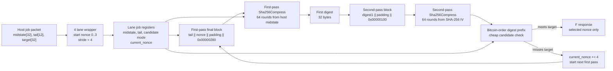
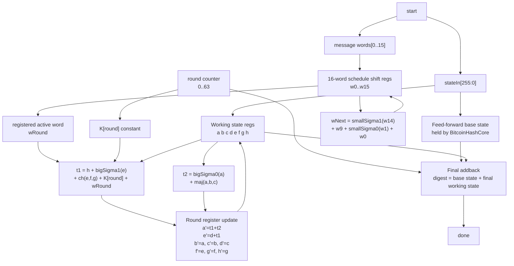
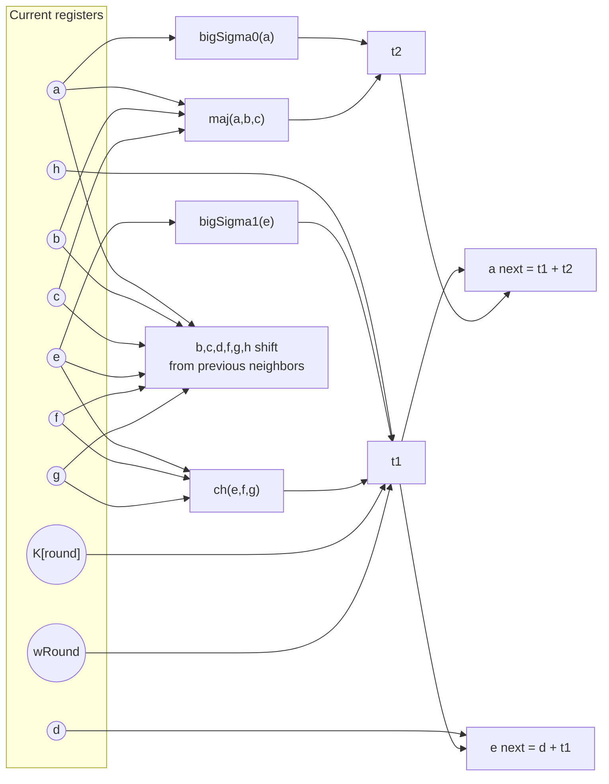
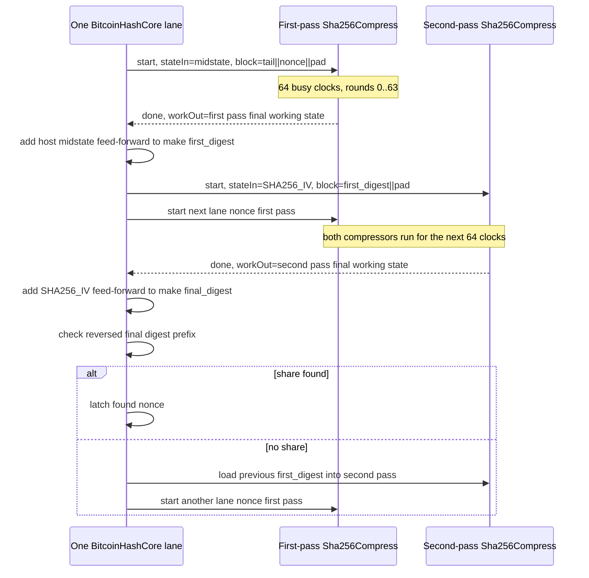

# Compression Circuitry

TangMiner uses four compact iterative SHA-256 lanes on the Tang Nano 20K. Each
lane has two `Sha256Compress` blocks: one dedicated to the first Bitcoin
SHA-256 pass and one dedicated to the second pass. The 64 SHA-256 rounds are
still not unrolled; each compressor performs one round per FPGA clock.

The top level gives the lanes different nonce residue classes: starts `0..3`
and stride `4`. The diagrams below show the datapath inside one lane unless
they explicitly call out the four-lane wrapper.

## Per-Lane Nonce Flow



The first compressor pass continues the SHA-256 state that the host already
computed over bytes `0..63` of the Bitcoin header. The FPGA only builds the
final 64-byte first-pass block from `tail`, the lane's current nonce word, and
standard SHA-256 padding.

The second pass hashes the 32-byte first digest from the normal SHA-256 IV.
While that second-pass compressor is busy, the first-pass compressor can already
start the next nonce for the same lane. After the second pass, the lane checks
the final digest in Bitcoin's byte-reversed proof-of-work ordering. The
implementation only wires the needed prefix bits for the selected quick filter;
it does not build a full 256-bit reversed digest or target comparator in the
four-lane 20K path. The host validates the returned candidate nonce by
rebuilding the header and double-hashing it. If more than one lane is reporting,
the top level latches one selected result before UART transmit.

For bring-up with frequent candidate output on the default `111 MHz` 20K build,
the host tools accept the named target `quick23`:

```text
000001ffffffffffffffffffffffffffffffffffffffffffffffffffffffffff
```

That target is equivalent to requiring the top 23 bits of the byte-reversed
digest to be zero. The bitstream also recognizes `all-ones` for immediate smoke
tests, `quick3` for short RTL tests, `quick21` as an easier legacy candidate
filter, and `quick26` for quieter candidate output. Exact validation remains on
the host.

## Compressor Datapath



The schedule memory is a rolling 16-word window. During each busy cycle, the
core consumes `w0`, shifts `w1..w15` down by one slot, and writes the newly
expanded word into `w15`.

The working state update is the standard SHA-256 round transform. All additions
are 32-bit modular additions because each expression is resized back to 32 bits.

## One Compressor Round



The compressor performs exactly one SHA-256 round per clock while busy. The
active schedule word is registered as `wRound` so the round datapath does not
read directly through the shifting schedule window. Round
`63` produces the final working values. `BitcoinHashCore` then adds those words
back into the correct feed-forward base state: the host-provided midstate for
the first pass, or the fixed SHA-256 IV for the second pass. Keeping that
feed-forward state outside the compressor avoids duplicating the eight 32-bit
starting-state registers inside the round engine.

## Control Timing



In steady state, the first-pass compressor launches a new lane nonce every `64`
clocks while the second-pass compressor checks the previous first digest. Each
lane therefore produces one tested nonce every `64` clocks after the initial
fill. With four lanes in parallel, the aggregate chip cadence is one tested
nonce every `16` clocks.

## Source Pointers

- `Sha256Compress` is implemented in `src/main/scala/tangminer/TangMiner.scala`.
- `BitcoinHashCore` constructs the two SHA-256 blocks, sequences the compressors,
  increments the lane nonce by the configured stride, and performs the candidate
  prefix check.
- `src/sha256_compress.v` is the legacy hand-written Verilog compressor kept for
  comparison and simulation.
