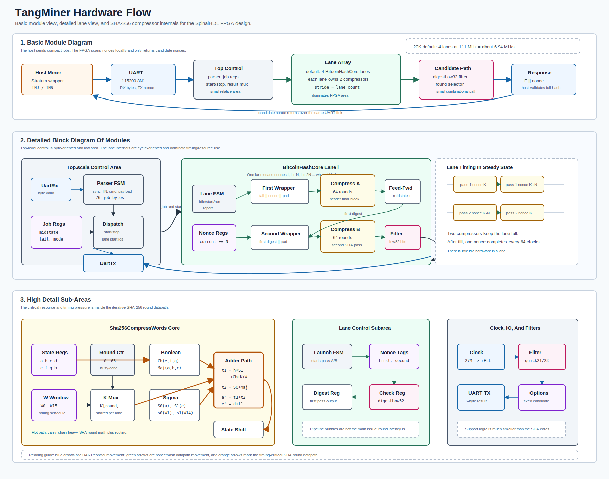

# Hardware Overview

The active TangMiner bitstream is a small UART-controlled hash engine for the
Tang Nano 20K. The host does the pool-facing work and sends compact jobs to the
FPGA. The FPGA then loops over nonces locally and only talks back when a nonce
meets the configured candidate filter.

At a high level:

- `UartRx` samples incoming serial bits and emits bytes.
- The top-level parser finds the `TN` sync bytes, decodes the command, and loads
  the job registers.
- Four default `BitcoinHashCore` lanes split the nonce space by residue: lane
  starts `0..3`, and each lane increments by `4`.
- Each default lane has two iterative `Sha256Compress` engines: one for the
  header final-block pass and one for the second SHA-256 pass. Experimental
  wider lanes can hold two local A/B compressor pairs with shared job and
  prefix-preparation logic.
- Each lane adds the SHA-256 feed-forward state outside the compressors: job
  midstate for pass one, SHA-256 IV for pass two.
- The final digest is checked in Bitcoin's byte-reversed proof-of-work ordering
  with a small prefix filter instead of a full 256-bit target comparator.
- On a hit, a priority selector latches one found nonce and sends `F || nonce`.
- The host reconstructs the block header, recomputes the hash, and performs the
  full share target comparison.

On the 20K build, the onboard `27 MHz` clock feeds an internal Gowin `rPLL` that
drives the hash fabric at `111 MHz`. In steady state each default lane launches
a new nonce every `61` FPGA clocks because the first pass starts after a
job-level three-round prefix and the second pass stops after the round needed
for the low32 filter word. Setting `SPINAL_ROUND_SKIP=0` builds a full 64-round
A/B path for routing experiments. With four single-pair default lanes, the
aggregate chip cadence is one tested nonce every `15.25` clocks, or about
`7.28 MH/s`.

These boxes are logical hardware blocks. After synthesis, they become Gowin
FPGA LUTs, flip-flops, carry chains, IO buffers, and routing rather than
software tasks.
