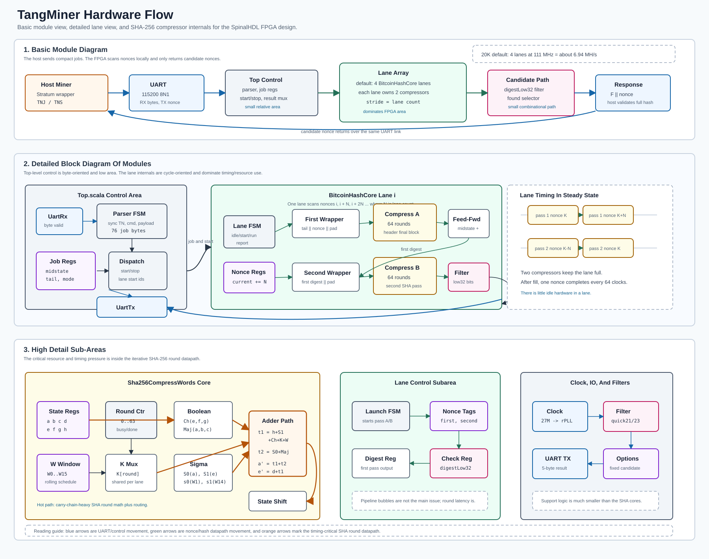

# Hardware Overview

The active TangMiner bitstream is a small UART-controlled hash engine for the
Tang Nano 20K. The host does the pool-facing work and sends compact jobs to the
FPGA. The FPGA then loops over nonces locally and only talks back when a nonce
meets the configured candidate filter.

At a high level:

- `UartRx` samples incoming serial bits and emits bytes.
- The top-level parser finds the `TN` sync bytes, decodes the command, and loads
  the job registers.
- Five `BitcoinHashCore` lanes split the nonce space by residue: lane starts
  `0..4`, and each lane increments by `5`.
- Each lane has two iterative 64-round `Sha256Compress` engines: one for the
  header final-block pass and one for the second SHA-256 pass.
- Experimental round-skip mode precomputes first-pass rounds 0..2 once per job
  and starts nonce-dependent work at round 3.
- Each lane adds the SHA-256 feed-forward state outside the compressors: job
  midstate for pass one, SHA-256 IV for pass two.
- The final digest is checked in Bitcoin's byte-reversed proof-of-work ordering
  with a small prefix filter instead of a full 256-bit target comparator.
- On a hit, a priority selector latches one found nonce and sends `F || nonce`.
- The host reconstructs the block header, recomputes the hash, and performs the
  full share target comparison.

On the default 20K build, the onboard `27 MHz` clock feeds an internal Gowin
`rPLL` that drives the hash fabric at `54.000 MHz`. In steady state each lane
launches a new nonce every `64` FPGA clocks because its first-pass and
second-pass compressors run at the same time. With five lanes, the aggregate
chip cadence is one tested nonce every `12.8` clocks, or about `4.219 MH/s`.
The selected 20K build uses `synth_gowin -nowidelut` with nextpnr seed `13` and
has passed strict host nonce validation on real hardware.

With `SPINAL_ROUND_SKIP=1`, each lane launches a nonce every `61` clocks by
skipping the nonce-independent first-pass rounds and deriving the low candidate
word after second-pass round 60. That mode is experimental until strict host
nonce validation passes on real hardware.

These boxes are logical hardware blocks. After synthesis, they become Gowin
FPGA LUTs, flip-flops, carry chains, IO buffers, and routing rather than
software tasks.
